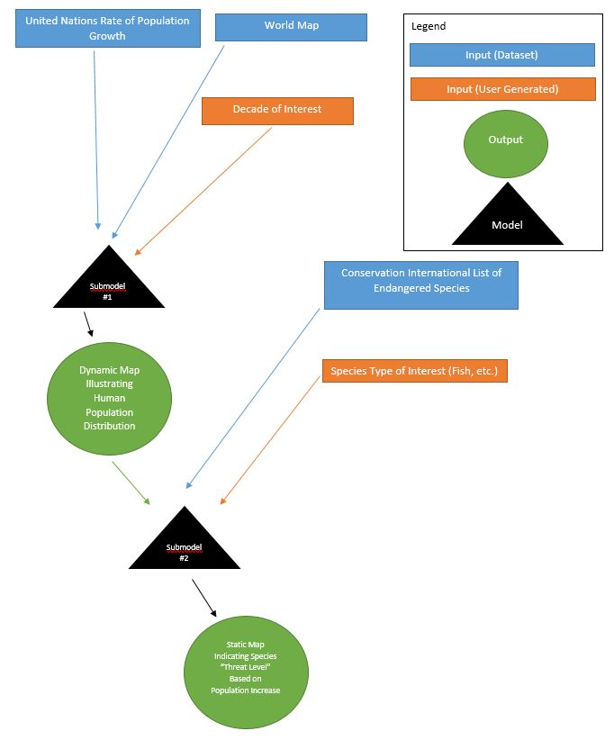

```{r setup, include=FALSE}
knitr::opts_chunk$set(echo = TRUE)
```

##Part 1
### Question 
###**How is population growth and changes in the distribution of humans going to impact endangered species?**
###Submodels: rate of population growth by country, number of endangered species by country, types of endangered species per country (fish, mammal)
###Parameters Analysed: rate of population growth by country, projected distribution of endangered species, projected distribution of human population(spatial)
###Population growth is expected to differ by country, with the countries expected to experience the largest growth also having the highest biodiversity. By predicting the redistribution of population to the year 2100, conservationists can target their efforts and finances toward countries with high biodiversity and a high number of endangered species that are predicted to experience a population boom. 




##Part 2
###Develop a conceptual model of your approach
###Popuation growth: spatial, differs by country. Dynamic: the population growth rates will change per year up through 2050. Total population per country will be dynamic, changing each year. The country borders themselves will be static, based on the countries present in 2010. The model for number of endangered species per country should be deterministic. The final outcome should be a series of maps. One will show distribution of population per decade (a dynamic map controlled by user input decade), the other will be a single, static map showing *where* endangered are species are located and what type of species are there. This map will give an indication of 'threat level' per species based on population growth rates. 
###The big question: By the year 2100, where will the most populated countries on earth be? How many endangered species are present in each country? What types of species are present? **What is the species threat level?**


